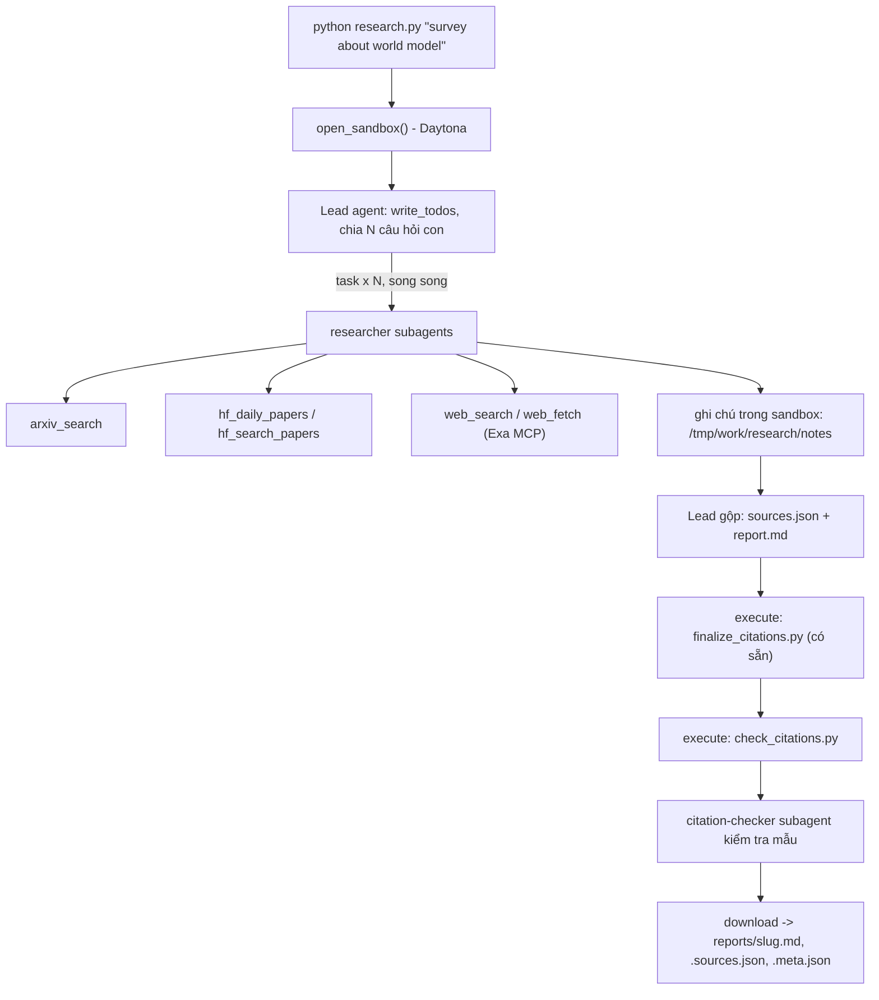

# Deep Research Agent (Deep Agents + Sandbox)

Lab dựng một **hệ thống deep research đa tác tử**: người dùng chỉ cần nhập một chủ đề (ví dụ `survey about world model`), hệ thống tự lập kế hoạch, giao việc cho nhiều subagent, tìm tài liệu trên arXiv, Hugging Face và web, rồi viết một **báo cáo có trích dẫn**.

Hình thức: **bài thực hành cá nhân**. Ngôn ngữ lập trình: Python 3.11 trở lên.

## 1. Mục tiêu học tập

Sau lab, bạn có thể:

1. Dựng agent bằng thư viện Deep Agents (LangChain): công cụ (tool), system prompt, subagent, backend.
2. Dùng **sandbox** (Daytona) làm không gian làm việc và nơi chạy mã cho agent; hiểu vì sao khóa API và công cụ mạng phải nằm ở phía host chứ không nằm trong sandbox.
3. Viết công cụ gọi API ngoài **chịu được giới hạn tốc độ** (retry, backoff, jitter, `Retry-After`).
4. Thiết kế quy trình đa tác tử: lead chia nhỏ câu hỏi, giao cho N researcher chạy song song, tổng hợp và kiểm tra trích dẫn.
5. Tạo báo cáo có thể kiểm chứng: mọi khẳng định có `[n]` trỏ tới một nguồn có thật.

## 2. Hệ thống làm gì



Nguồn dữ liệu:

| Nguồn | Dùng để |
|---|---|
| arXiv API `https://export.arxiv.org/api/query` | Tìm bài theo từ khóa, sắp theo ngày |
| Hugging Face Daily Papers `/api/daily_papers` | Bài đang "trending": upvotes, githubRepo, summary |
| Hugging Face papers search `/api/papers/search?q=` | Tìm bài theo chủ đề |
| Web qua Exa MCP (`web_search_exa`, `web_fetch_exa`) | Blog, survey, trang dự án, nội dung đầy đủ của một URL |

## 3. Cấu trúc thư mục

```
Lab/
├── README.md  GUIDE.md  RUBRIC.md  REPORT_TEMPLATE.md   tài liệu
├── topics.md                 5 chủ đề cần chạy
├── requirements.txt  .env.example  .gitignore
├── model.py                  CÓ SẴN - không sửa: tạo mô hình LLM từ biến môi trường
├── sandbox.py                CÓ SẴN - không sửa: sandbox Daytona (hoặc Docker), upload, download
├── self_check.py             CÓ SẴN - không sửa: tự kiểm tra trước khi nộp (python self_check.py)
├── finalize_citations.py     CÓ SẴN - không sửa: script chạy trong sandbox, tự sinh `## References` và đánh số lại trích dẫn
├── tools.py                  SINH VIÊN CÀI ĐẶT: retry + 5 công cụ nguồn dữ liệu
├── agents.py                 SINH VIÊN CÀI ĐẶT: prompt, subagent, lead agent
├── research.py               SINH VIÊN CÀI ĐẶT: script chính
├── check_citations.py        SINH VIÊN CÀI ĐẶT: kiểm tra trích dẫn, chạy TRONG sandbox
└── reports/                  báo cáo sinh ra (bạn commit vào repo nộp)
```

Các tệp `tools.py`, `agents.py`, `research.py` và `check_citations.py` đã được cài đặt. `GUIDE.md` giải thích yêu cầu của từng phần. Báo cáo không có sẵn: agent phải tạo chúng trong một lần chạy thành công.

## 4. Cài đặt

### Windows PowerShell (Python 3.11+)

```powershell
python -m venv .venv
.\.venv\Scripts\Activate.ps1
python -m pip install -r requirements.txt
# Chỉ sao chép nếu chưa có .env; không ghi đè cấu hình hiện tại.
if (-not (Test-Path .env)) { Copy-Item .env.example .env }
```

Điền cấu hình thật vào `.env` trước khi chạy. Giá trị `openai:<model name>` trong mẫu chỉ là placeholder, không phải tên mô hình hợp lệ. Nếu môi trường ảo đã được kích hoạt (terminal hiện `(.venv)`), không cần tạo lại nó.

Nếu PowerShell không cho kích hoạt môi trường ảo, dùng trực tiếp Python của nó, không cần đổi execution policy:

```powershell
& .\.venv\Scripts\python.exe -m pip install -r requirements.txt
& .\.venv\Scripts\python.exe research.py "survey about world model"
```

Bạn cần ba loại khóa (điền vào `.env`, **không bao giờ commit** `.env`):

| Khóa | Lấy ở đâu | Ghi chú |
|---|---|---|
| LLM (`LAB_MODEL` + khóa nhà cung cấp) | Nhà cung cấp bạn chọn (OpenAI, Anthropic, Google, OpenRouter, Ollama...) | Mô hình **phải hỗ trợ tool calling**. Chép tên mô hình từ tài liệu của nhà cung cấp. |
| `DAYTONA_API_KEY` | https://app.daytona.io | Kiểm tra gói miễn phí / credit hiện hành. Không có tài khoản hoặc hết credit: đặt `SANDBOX=docker` để chạy sandbox trong container Docker cục bộ (xem `.env.example`). |
| `EXA_API_KEY` (khuyến nghị) | https://dashboard.exa.ai/api-keys | Có thể chạy không khóa, nhưng bản miễn phí của MCP bị giới hạn tốc độ rất nhanh. |

## 5. Chạy và đọc báo cáo

Sau khi cấu hình `.env`, chạy từ thư mục gốc của repo:

```powershell
python research.py "survey about world model"
```

**Không cần tạo `report.md` trước. Đây là đầu ra, không phải đầu vào.** Agent phải ghi `/tmp/work/report/report.md` và `/tmp/work/research/sources.json` bên trong sandbox, chạy finalizer và validator, rồi chương trình tải kết quả về máy.

Một lần chạy thành công in `Report saved to: ...` và tạo ba tệp:

| Tệp | Nội dung |
|---|---|
| `reports/survey-about-world-model.md` | Báo cáo tiếng Anh, các trích dẫn `[n]` và danh sách References |
| `reports/survey-about-world-model.sources.json` | Nguồn tương ứng với từng số trích dẫn |
| `reports/survey-about-world-model.meta.json` | Chủ đề, mô hình, thời gian, số lần gọi tool/subagent, token của lead và họ nguồn |

Kiểm tra trích dẫn sau khi đã có báo cáo:

```powershell
python check_citations.py .\reports\survey-about-world-model.md .\reports\survey-about-world-model.sources.json
```

### Lỗi `FAILED: report.md is missing or empty`

Lỗi này phát sinh ở bước tải đầu ra: chương trình không nhận được nội dung báo cáo từ sandbox. Nó **không có nghĩa là bạn phải tạo một tệp `report.md` trên máy**. Các khả năng gồm agent kết thúc trước bước viết, ghi sai đường dẫn, thao tác ghi thất bại, hoặc tải tệp thất bại. Chỉ thông báo này chưa đủ để xác định nguyên nhân.

1. **Kiểm tra mô hình**: `LAB_MODEL` phải là tên thật và endpoint phải hỗ trợ tool calling, không chỉ trả lời văn bản. Lead cần gọi `task`, các công cụ tệp và `execute`. Agent chỉ trả lời trong chat thì chưa tạo báo cáo.
2. **Kiểm tra nguồn độc lập với agent**:

   ```powershell
   python tools.py
   ```

   Lệnh này gọi API thật, có thể mất thời gian vì retry. Tìm kết quả `ERROR:` hoặc `NO RESULTS`; nếu Exa liên tục giới hạn tốc độ, cấu hình `EXA_API_KEY`. Không coi thông báo giới hạn tốc độ là nội dung nghiên cứu.
3. **Kiểm tra sandbox**: Daytona cần khóa hợp lệ và credit. Nếu dùng Docker, Docker Desktop phải đang chạy, đặt `SANDBOX=docker` trong `.env`, rồi kiểm tra:

   ```powershell
   docker info
   ```

4. **Đọc lỗi chi tiết**: chương trình kiểm tra đầu ra trong sandbox và cho agent tiếp tục tối đa một lần nếu công việc chưa hoàn tất. Nếu mô hình không gọi tool, chương trình báo `agent made no tool calls`; nếu kiểm tra trích dẫn thất bại, lỗi kèm kết quả validator và phản hồi cuối của agent; lỗi tải tệp được báo riêng. Lần tiếp tục có thể tốn thêm token. Không tăng giới hạn tự động. Chạy kiểm tra offline cho luồng này bằng `python test_research.py`.
   Với Gemini, phản hồi rỗng có thể mang `finish_reason=MALFORMED_FUNCTION_CALL`: mô hình có hỗ trợ tool calling nhưng sinh lời gọi không hợp lệ cho bộ công cụ của agent. Chương trình thử sửa một lần và hiển thị finish reason khi vẫn thất bại. Nếu lỗi lặp lại, chọn một mô hình hỗ trợ tool calling khác trong `.env`; đừng tạo `report.md` thủ công hoặc tăng giới hạn để che lỗi này.
5. **Sau khi sửa nguyên nhân**, chạy lại lệnh nghiên cứu. Việc chạy lại tốn token và thời gian sandbox; không tăng giới hạn hoặc thử lặp vô hạn khi chưa có bằng chứng.

Sandbox được dọn khi chương trình kết thúc, kể cả khi chạy lỗi; ghi chú của lần chạy lỗi không được lưu về máy theo luồng hiện tại. Không tạo báo cáo rỗng, không sửa tay báo cáo để vượt kiểm tra, và không chạy validator trước khi có đủ hai tệp đầu ra. Xem thêm [GUIDE.md, Phần 5](GUIDE.md#5-chạy-5-chủ-đề-và-xử-lý-sự-cố).

## 6. Chủ đề và nộp bài

- Chạy đủ **5 chủ đề** trong [`topics.md`](topics.md), mỗi chủ đề một lần.
- Commit mã nguồn và toàn bộ `reports/`, đẩy lên một **public repo** GitHub và nộp link.
- Kiểm tra trước khi nộp: chạy **`python self_check.py`** (không tốn token): nó kiểm tra đủ 5 báo cáo, `meta.json`, trích dẫn bằng `check_citations.py` của bạn, và không có `.env`/khóa nào trong git.
- Cách chấm: xem [`RUBRIC.md`](RUBRIC.md).

## Local Ollama timeouts

When `LAB_BASE_URL` (or `OPENAI_ENDPOINT`) points to localhost, research allows 600 seconds per model request and disables automatic retries. Hosted providers retain their existing timeout/retry settings. CPU-only models may be slow, especially with parallel researchers. Inspect `http://localhost:11434/api/ps`: `size_vram: 0` indicates no model weights loaded on GPU. A longer timeout is not a speed improvement; use GPU acceleration or a smaller tool-capable model if needed.

## Small requests for restricted API tiers

Lead and subagents now send only the initial task and newest complete tool-call exchanges that fit a conservative 18,000-byte request budget, including system instructions and shortened tool descriptions. Full conversation history remains in agent state; research notes remain in sandbox files. Output is capped at 1,000 tokens per call, so reports should be written section by section. Oversized tool results are sent as explicitly marked previews, preserving all tool-call IDs and the full original results in agent state. The agent must retrieve smaller slices or fewer results before using omitted evidence. Oversized initial tasks or tool-call arguments still fail explicitly. Run `python test_research.py` for offline checks.

If Groq rejects an invented tool name (for example `exec` instead of `execute`), the middleware retries once with the registered tool names. Other 400 errors, quota failures, and network errors are not retried by this correction.

This is bounded context, not lossless document chunking or an exact provider token count. Groq's shared TPM quota still applies across concurrent subagents; smaller requests do not guarantee that a full research run fits the free tier.

## 7. Thời gian, chi phí và an toàn

- Dùng một mô hình **rẻ nhưng hỗ trợ tool calling**, và **đặt giới hạn** (số lần gọi mô hình/công cụ cho lead và subagent, `recursion_limit`): một prompt hỏng có thể khiến agent lặp rất lâu. Đây là hạng mục 2.5 của `RUBRIC.md`.
- Kết quả có tính ngẫu nhiên: cùng một mã có thể cho báo cáo hợp lệ ở lần này và trích dẫn lỗi ở lần sau. Hãy sửa **prompt và mã**, không sửa tay báo cáo.

- Mỗi lần chạy tốn token LLM và thời gian sandbox. `tokens` trong `meta.json` chỉ đếm tin nhắn của lead, chưa gồm subagent, nên chi phí thật cao hơn. `open_sandbox()` luôn dừng và xóa sandbox khi kết thúc, kể cả khi lỗi. Đừng bỏ qua nó.
- **Không đưa bí mật vào sandbox.** Sandbox không ngăn được prompt injection hay việc đẩy dữ liệu ra mạng; một trang web độc hại có thể khiến agent chạy lệnh bên trong sandbox. Vì vậy mọi công cụ gọi mạng và mọi khóa ở lại phía host.
- Nội dung lấy từ web là **dữ liệu không đáng tin**: agent không được làm theo chỉ dẫn nằm trong đó.
